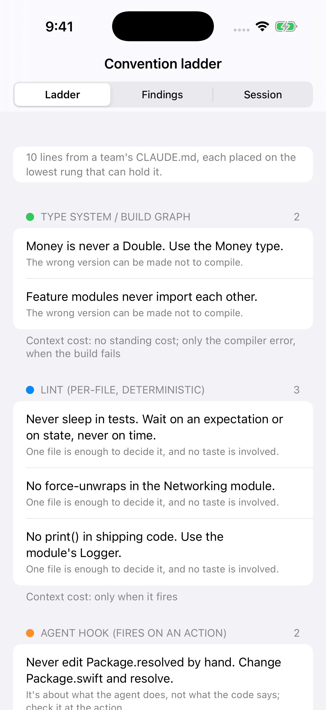
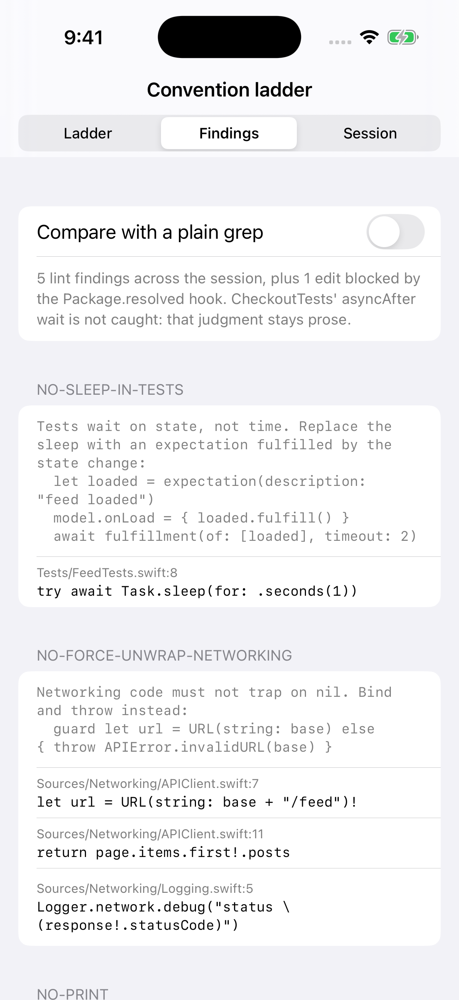
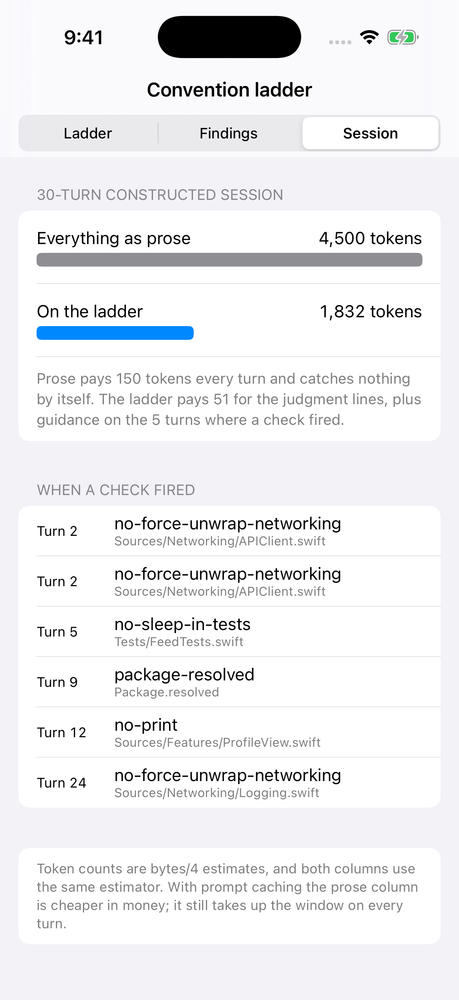

# ConventionLadder

**Stop asking your coding agent to remember your team's rules. Put each rule on the lowest rung that can hold it.**

Article: [I Sorted a Team's CLAUDE.md Onto a Ladder. Only 3 of 10 Rules Needed to Stay Prose.](https://medium.com/@er.rajatlakhina/i-sorted-a-teams-claude-md-onto-a-ladder-only-3-of-10-rules-needed-to-stay-prose-cd39aefaaeb3) (Medium)

Most iOS teams' `CLAUDE.md` / `AGENTS.md` is a list of conventions written as prose. Prose is probabilistic: the model may or may not recall a line when it matters, and every line sits in the context window on every turn. This package is a small, runnable version of the alternative: sort each convention onto a ladder, and only keep the ones that need judgment as prose.

| Rung | Holds | Context cost |
|---|---|---|
| Type system / build graph | "Money is never a Double", "feature modules never import each other" | no standing cost; only the compiler error, when the build fails |
| Lint (per-file, deterministic) | "never sleep in tests", "no force-unwraps in Networking", "no print()" | only when it fires |
| Agent hook (fires on an action) | "never edit Package.resolved by hand", "run the tests before you say done" | only when it fires |
| Prose in CLAUDE.md | "prefer composition over subclassing", "explain the failure mode in checkout PRs" | every turn |

<p align="center">
  
  
  
</p>

## What's in it

- **`LadderAdvisor`**: places a convention from four questions, in this order: can a type make the wrong code not compile? Is it about an agent *action* rather than code? Is it decidable from one file? Otherwise it needs judgment and stays prose.
- **`SourceMasker`**: a small Swift lexer that blanks comments and string contents (keeping string delimiters, line breaks and the code inside `\(...)` interpolation) so a rule can never fire on `// sleep(1)` or `"wow!"`.
- **`NoSleepInTests`, `NoForceUnwrap`, `NoPrintInSources`**: lint-rung rules that run on masked source, scoped by path.
- **`LintGate`**: runs the rules and returns guidance *only* for what fired, with a corrective example and the exact `path:line`. This is the shape SwiftFairy uses over MCP.
- **`ProtectedPathHook`**: a hook-rung check shaped like a Claude Code `PreToolUse` hook: it blocks an edit before it happens, and its reason goes back to the agent.
- **`SessionCost`**: replays a 30-turn constructed session under both policies and counts context tokens.
- **`SampleTeam`**: the ten conventions and ten file writes the numbers come from. Constructed by hand, not produced by a model.

```swift
let gate = LintGate(conventions: SampleTeam.conventions)
let findings = gate.findings(in: SampleTeam.allWrites)
print(gate.feedback(for: findings))
// [no-sleep-in-tests] Tests wait on state, not time. Replace the sleep with an expectation ...
//   Tests/FeedTests.swift:8: try await Task.sleep(for: .seconds(1))
```

```swift
let report = SampleTeam.replay()
report.proseOnlyTokens   // 4_500  (150 tokens of CLAUDE.md x 30 turns)
report.ladderTokens      // 1_832  (51 tokens of judgment prose x 30, plus guidance on 5 turns)
report.events.count      // 6      (5 lint findings + 1 blocked Package.resolved edit)
```

### What the numbers do and don't say

- On the sample session the lint rules fire 5 times and the hook blocks 1 edit. A plain substring grep for the same three rules flags **13 lines, 8 of them wrong** (comments, a string literal, `!=`, a `!` negation). Precision is the feature: a noisy check gets switched off.
- One thing is deliberately **not** caught: `CheckoutTests` waits with `DispatchQueue.main.asyncAfter`. That's still waiting on time, but it isn't a call to `sleep`. "Wait on state, not time" is the judgment; the lint only catches its most common symptom. That line stays prose.
- The two type-system rules count in the all-prose column (that's where they'd sit as prose) and cost nothing on the ladder; the compiler error a failed build would produce isn't modelled. Drop them from both columns and it's 3,840 vs 1,832.
- Token counts are UTF-8 bytes / 4 estimates, the same estimator on both sides. With prompt caching, the prose column is cheaper in money than it looks. It still occupies the window on every turn.
- `try!` and `as!` are not force *unwraps* and don't fire. Implicitly unwrapped optionals (`String!`) do.
- This is a lexer, not a parser. A production rule set should sit on SwiftSyntax; the masker keeps the demo dependency-free and runnable on Linux CI.

## How to run it

```bash
git clone https://github.com/rajatslakhina/convention-ladder-article-demo.git
cd convention-ladder-article-demo
open Demo.xcodeproj
```

Pick the **Demo** scheme and any iPhone Simulator, then Build & Run. No other setup: the app consumes the library through a local package reference to this same repo.

Library only:

```bash
swift build
swift test
```

## Verification status

- `swift build -Xswiftc -warnings-as-errors` and `swift test`: **20 XCTest cases pass** on Swift 6.1.2 (Linux). Every number quoted above is asserted in `Tests/ConventionLadderTests`.
- iOS Simulator: built and launched by GitHub Actions (`.github/workflows/ci.yml`, `macos-15`) with `Scripts/simulator-screenshots.sh`, which builds `Demo.xcodeproj`, installs the app on an iPhone Simulator, launches it once per tab, checks the process is still alive after 8 seconds, and saves the screenshots in `Demo/Screenshots/`. Nobody tapped through the UI by hand.

## Credit

The "hand back guidance only for the issues actually present" shape comes from Nil Coalescing's [SwiftFairy](https://nilcoalescing.com/blog/IntroducingSwiftFairy/). Hook semantics follow [Claude Code hooks](https://code.claude.com/docs/en/hooks). This repo is an independent illustration, not affiliated with either.

MIT licensed.
